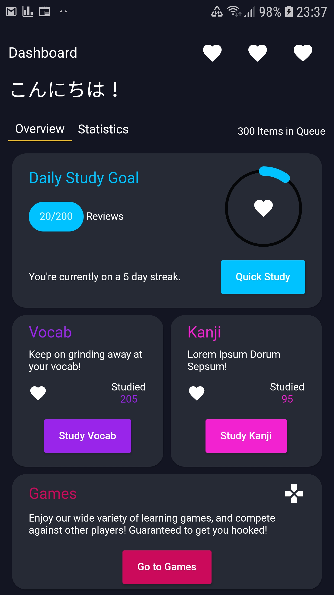

# KanjiMaru

Flashcard and Kanji writing mobile app made in Flutter. After a somewhat long hiatus, I have decided to resume this Hobby Project of mine. 

As I have been frustrated by the fact that apps on the market do not provide a 'good' way to learn to write Japanese Characters, I have decided to create my own app.  

Inspired by both Anki and WaniKani, tools which I still use at the moment on my Japanese learning journey. While they are great tools, I have been wanting to create something of my own for a while.

Although the idea is to have this app be open source, if I ever decide to publish it, I might make this repo private, as I am not sure on the licensing.

## UI
`Current Mock 'Overview Screen.`

 

## Planned Features
Barebone features that this project will have to satisfy for me.

- [ ] Front-end
    - [ ] Overview Page
    - [ ] Statistics Page 
    - [ ] Settings Page
    - [ ] Games Page
- [ ] Firestore
    - [ ] Login System
    - [x] Firestore Integration
    - [x] Update UI on Firestore Changes
    - [x] Update Firestore on User Interaction/Background Processing
    - [x] Create models to represent data to be stored in Firestore

- [ ] SRS
    - [x] Implement the SM2 algorithm
    - [ ] Hook up SRS to the rest of the application
    - [ ] Create efficient ways of mapping SRS data to Firestore

- [ ] Learn System (Cannot review what you have not learned yet.)
- [ ] Flashcard (Review) System

- [ ] Kanji Writing Cards
    - [ ] Implement Writing Package
- [ ] WaniKani Import
- [ ] Implement Import from pre-defined decks

- [ ] Japanese Character Data
    - [x] Deserialize JP Data and Graphics into usable format 
    - [ ] Hook up Backend to this Data

- [ ] Learning Games
    - [ ] Implement Shiritori
    - [ ] Implement Game where you have n pairs of cards mixed up, and you try to match them (Meaning -> Reading or other way around)

## Where does the name come KanjiMaru come from?
It comes from an adorable fluff ball named Maru. The reason I remember the Kanji '丸'.

`Click to watch the video. You must watch it!`

